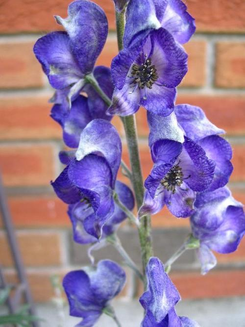

# PyTorch Challenge 2018 - Flower Data Classification

This project is was developed as a solution to a problem presented at the PyTorch Scholarship Challenge 2018. Convolutional neural network was developed in order to classify photos of flowers into 102 categories.

## Prerequisites

* torch
* torchvision
* numpy 

## Results

On the test data model shows accuracy 
