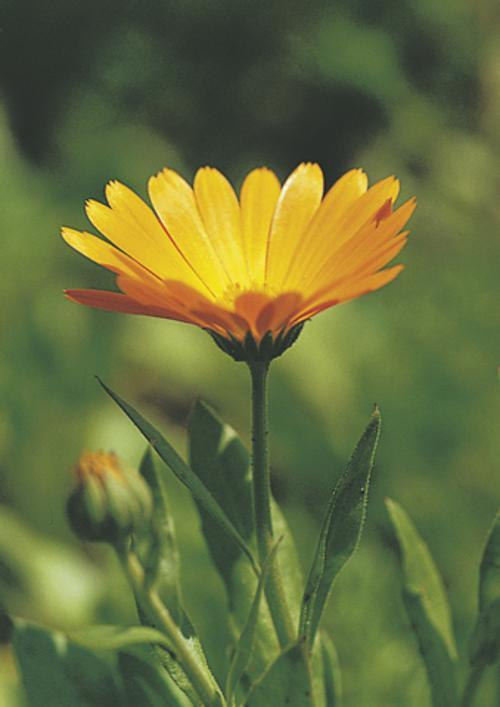

# PyTorch Challenge 2018 - Flower Data Classification

This project is was developed as a solution to a problem presented at the PyTorch Scholarship Challenge 2018. Convolutional neural network was developed in order to classify photos of flowers into 102 categories.

  

## Prerequisites

* torch
* torchvision
* numpy 


## Using the classifier

In order to train and evaluate a model, location of data must be passed as a command line argument. Inside the provided folder there should be folders train and validate containing images for training and validation of the model.

```bash

python final_project.py --train data_path 
```
To predict a class of an image using a pretrained model a path to image must be provided as the command line argument
```bash

python final_project.py --predict image_path

```


## Results

On the test data model shows accuracy 
